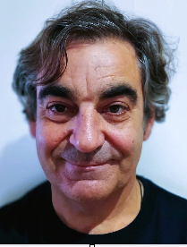

*I am an Industrial Technical Engineer in the specialty of Industrial Electronics from the EUTI of Jaén. I also have a degree in Computer Systems Engineering from the UNED and finally I've a Master's degree in Computer Engineering from UAL (IOT speciality).*

*I have worked at Telefónica de España for almost 30 years in digital switching systems, digital transmission and energy systems. I have also been a network administrator and web developer, PL-SQL (Oracle), Java, ASP, JSP, JS, CSS, etc. I have also worked as a Project Manager at Telefónica de España (in document systems based on EMC Oracle-Text and Documentum).*

*For about 15 years I have been a collaborating professor at the EET of Telefónica en Sistemas. I have also been a beta-tester in the IdeaLab area of Telefonica de España*
*I am currently retired, but I have not lost the desire to continue learning because  because I am currently a PhD student at the UAL in Industrial Engineering.*

*I have published two books and also numerous articles in both technology and scientific journals. I am passionate about technology because I believe it can help humanity improve in many aspects.*

*.*

## Working Live

I am an Industrial Technical Engineer in the branch of electricity with the specialty of Industrial Electronics at the EUTI of Jaén and I am also a Technical Computer Systems Engineer from the UNED.I also have a Master's Degree in Technologies and Applications in Computer Engineering, specializing in IOT (Internet of Things), from the UAL.

I am currently finishing my PhD studies in Industrial Engineering.

I have worked at Telefónica de España for almost 30 years in digital switching systems, digital transmission and energy systems. I have also been a network administrator and web developer, PL-SQL (Oracle), Java, ASP, JSP, JS, CSS, etc. I have also worked as a Project Manager at Telefónica de España (in document systems based on EMC Oracle-Text and Documentum)nd I have also been a collaborating professor at the EET (School of Technical Excellence of Telefónica) in the Systems chair in the Innovation part. I have won two Ideas competitions in Telefónica Spain (Energy Saving and Call Sending Automation).

In 2014 I was a finalist in the Big Idea Competition Europe.

## Publications in scientific journals

-   C. Rodriguez-Navarro, A. Alcayde, V. Isanbaev, L. Castro-Santos, A. Filgueira-Vizoso, and F. G. Montoya, “DSUALMH- A new high-resolution dataset for NILM,” *Renewable Energy and Power Quality Journal*, vol. 21, no. 1, pp. 238–243, Jul. 2023, doi: 10.24084/repqj21.286.
-   C. Rodríguez-Navarro, F. Portillo, F. Martínez, F. Manzano-Agugliaro, and A. Alcayde, “Development and Application of an Open Power Meter Suitable for NILM,” *Inventions*, vol. 9, no. 1, p. 2, Dec. 2023, doi: 10.3390/inventions9010002.

## Publications in journals

I am passionate about technology as well as creating new things that can help people.

I have published numerous technical articles over many years in national publications, including the following:

-   «Economic Recorder for Z80 ″ RESISTOR.
-   «EPROMs recorder for 2732 - 2732A» RESISTOR in number 131
-   Internet access problems with 386 ″ published by the BPE publishing house in SHOPPING GUIDE.
-   "Problems accessing Infovía-INTERNET with Windows 95".
-   Build your own Local Area network »(1st part) for the magazine« Igenium »nº1.
-   «Build your own Local Area network» (2nd part) for the magazine «Ingenium» nº2.
-   «Economic musical thread» «Todo Electrónica» nº 28.
-   «Multimedia possibilities from your PC to your TV» number 33 of the magazine «Todo Electrónica».
-   Multimedia Player based on PC with LCD display nº 35 TodoElectronica.
-   «Build your own GPS navigator» «TodoElectronica» nº 41.
-   Dolby Digital 5.1 to Dolby surround 2.1 converter, «TodoElectronica» nº45.
-   «VoIp Adapter», nº46, »TodoElectronica».
-   «Simple alarm for window», nº47, »TodoElectronica».
-   «Home audio and video network», nº50, »TodoElectrónica».
-   «Multipurpose USB oscilloscope-voltmeter for PC» nº50, TodoElectronica.
-   etc.

I've also written two books in both digital and paper format.

-   THE FIRST BOOK ABOUT NETDUINO 2 IN SPANISH: Step-by-step home automation projects for all levels (Spanish Edition) https://amzn.to/3soMo66.
-   Netduino 2 in Spanish: Echo Version (Spanish Edition) https://amzn.to/3IYX6Gs.

## Blogging

I am currently the editor of the following blogs:

-   https://soloelectronicos.com.
-   https://bicycleselectric.wordpress.com.
-   https://kobudo.wordpress.com.
-   https://takedakanalmeria.wordpress.com.

I'm learning martial arts since I can remember. These are my belts:

-   Second dan Karate by the RFEK (Royal Spanish Karate Federation
-   Kobudo Brown Belt by ABE (Spanish Budo Association)
-   Iaido Brown Belt by TAKEDA RYU-MAROTO HA

## Contact ways

If you need to contact me, you can address to the following emails:

-   soloelectronicos@telefonica.net
-   contacto@soloelectronicos.com
-   info@soloelectronicos.com

<!---
crn565/crn565 is a ✨ special ✨ repository because its `README.md` (this file) appears on your GitHub profile.
You can click the Preview link to take a look at your changes.
--->
